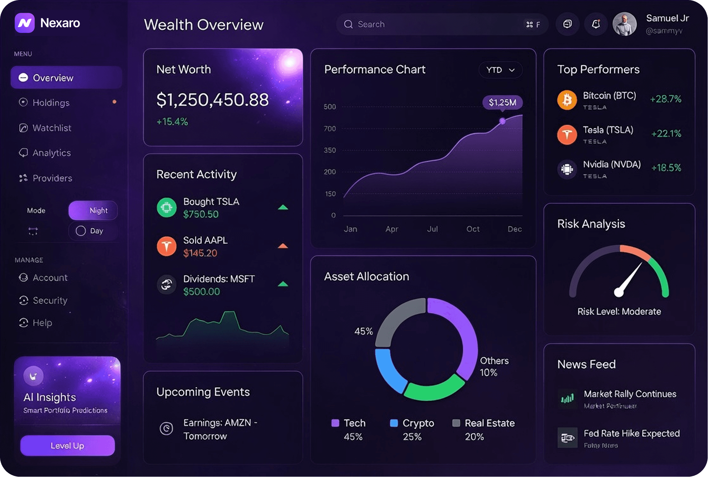

# Creatorbyte — AI Workflow & CRM Landing Page

A modern, fully responsive marketing landing page for an **AI‑powered CRM / workflow platform**. It pairs a deep‑space dark aesthetic with smooth scroll‑reveal motion, an animated product dashboard, and a continuously scrolling integrations carousel — built as a pixel‑faithful, production‑ready clone of the Nexaro design.

<p align="center">
  
</p>

---

## ✨ What the website does

It’s the public‑facing landing site that sells the product and converts visitors. Each section tells part of the story:

| Section | Purpose |
|---|---|
| **Hero** | Headline pitch — *“Build smarter, more efficient workflows with AI”* — with CTAs and a floating product dashboard. |
| **Logo marquee** | Social proof: a scrolling strip of trusted brands. |
| **Features** | Highlights core capabilities — AI workflows, smart lead management, and automation. |
| **Stats** | Animated count‑up metrics (98% satisfaction, 24/7 uptime, 120+ …). |
| **How it works** | A simple 3‑step onboarding flow. |
| **Pricing** | Monthly/Yearly toggle with tiered plans. |
| **Integrations** | A glowing podium with a seamless carousel of integration logos. |
| **Testimonials** | Customer quotes and partner logos. |
| **Blog** | Latest article cards. |
| **CTA + Footer** | Final conversion push and site navigation. |

**Routes:** `/` (home), `/features`, `/pricing`, `/blogs`, `/blogs/[slug]`, `/contact`.

---

## 🛠 Tech stack

- **[Next.js 16](https://nextjs.org/)** — App Router, Turbopack
- **React 19**
- **Tailwind CSS v4** — utility‑first styling with CSS‑variable design tokens
- **Framer Motion** — scroll‑reveal, parallax, count‑ups, and the integrations carousel
- **next/image** — optimized image delivery
- **TypeScript**

---

## 🚀 Getting started

```bash
# 1. Install dependencies
npm install

# 2. Run the dev server
npm run dev

# 3. Open the app
# http://localhost:3000
```

### Scripts

| Command | Description |
|---|---|
| `npm run dev` | Start the development server (Turbopack) |
| `npm run build` | Create a production build |
| `npm run start` | Serve the production build |
| `npm run lint` | Run ESLint |

---

## 📁 Project structure

```
src/
├─ app/                 # App Router pages & global styles
│  ├─ page.tsx          # Home (composes all sections)
│  ├─ features/         # Features page
│  ├─ pricing/          # Pricing page
│  ├─ blogs/            # Blog index + [slug] detail
│  ├─ contact/          # Contact page
│  └─ globals.css       # Design tokens, base styles, animations
├─ components/          # Hero, Features, Stats, Pricing, Integrations, …
└─ lib/                 # Helpers (blog data, mouse‑parallax hook)
public/assets/          # Images, icons & SVGs grouped by section
```

---

## 🎨 Design notes

- **Theme:** deep navy/near‑black background (`#060610`) with a violet accent (`#694AF9`).
- **Typography:** Inter, with gradient text accents on key headings.
- **Motion:** entrance reveals on scroll, subtle mouse parallax in the hero, animated stat counters, and an infinite‑loop integrations carousel.
- **Responsive:** adapts from mobile to wide desktop.

---

## 📄 License

This project is for demonstration / portfolio purposes.
